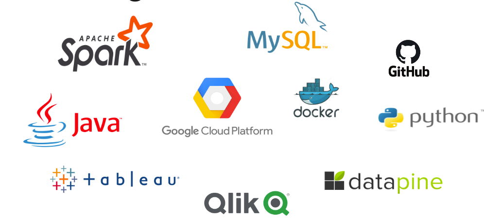

CA687I – Cloud Systems, 2023
# Exploring the Non-Fungible Token Revolution: An Analysis of NFT Transactions

Welcome to the world of Non-Fungible Tokens (NFTs)! As the digital revolution continues to shape the future, NFTs are emerging as a significant force in the digital asset market, offering unprecedented opportunities and potential applications that could revolutionize how we think about asset ownership and value.

The aim of our project is to investigate the NFT revolution by examining the transactions and trades that occurred between 2021 and 2023. We have thoroughly scrutinized and analysed the millions of NFT transactions carried out on various blockchains. Our primary objective was to identify financial and quantitative patterns in order to uncover valuable insights into the NFT market, which was estimated to be worth approximately USD 15.54 billion in 2021, according to Emergen Research.

Our analysis reveals several compelling metrics that offer valuable insights regarding purchase/sale activity, profit/loss margins, average transaction values, fluctuations in buy/sell prices, top-performing NFTs, collections, buyers, sellers, minters, and other noteworthy measures.

Undertaking this project was a fantastic chance for us to delve deeper into the NFT revolution and witness how it is reshaping the digital asset landscape. It is an exciting time to explore the world of NFTs and witness the constant progress and innovation. Our aim is for this project to offer valuable insights and inspire others to participate in this ground-breaking movement.

Data
-----

In our project, obtaining accurate and high-quality data was crucial to extract useful insights. Initially, we utilized a Kaggle dataset (8 GB) that provided valuable information about the nature of NFT transactions, such as the addresses of NFTs, tokens, and wallet addresses. However, it lacked essential information on crucial aspects such as transaction volumes, buyer, seller and minters information for the NFTs. We also needed data on collection names and values to identify patterns and trends in the market and track the value appreciation over time.

To enrich the dataset, we utilized publicly available Moralis APIs to gather additional data based on the initial dataset. Despite the number of restrictions on API calls, we were able to accumulate approximately 137 GB of additional data in just a few weeks. This decision turned out to be the right one, as it provided us with the comprehensive data we needed to derive more meaningful insights and enrich our initial dataset many folds.

Following are the datasets that we accumulated
1. Kaggle 8 GB General NFTs related attributes.
2. Moralis 110 GB Data specific to ERC721 contracts which contains deep information on NFTs, Types, Names and Metadata.
3. Moralis 27 GB Specific to NFT transfers i.e buyers, sellers, transaction value etc.

# Technologies and Tools

# Lik to the final project report
[Final Report - CA687I Cloud computing - Assignment-1.pdf](assignment-reports%2Ffinal-report%2FFinal%20Report%20-%20CA687I%20Cloud%20computing%20-%20Assignment-1.pdf)

# Link to the presentation
[Cloud Systems Assignment 1 Presentation V2.pptx](assignment-reports%2Ffinal-report%2FCloud%20Systems%20Assignment%201%20Presentation%20V2.pptx)

# Developer-notes
# nft-data-processor

Prerequisite
--------------
Install spark libs and have a standalone or cluster setup running spark master/workers. I have tested this application successfully on both the environment.
- GCP Dataproc (1 master + 6 workers (4 cores + 16GB)) 
- Standalone installaction of Spark on my macbook-pro 16-cores + 32GB, 

command to build the project
---------------------------------------
This is a maven project that uses maven-wrapper, so make sure you have it all installed before building.
./mvnw clean install

deployment on spark cluster
--------------------------------
once the build is successful, you need to package your code in a app;lication.jar that can be run using the spark-submit. 
For this application, you will find spark-data-processor-1.0-SNAPSHOT.jar in your target directory that needs to be shipped to cloud or local standalone spark machine to run the jobs.  

command to run the code -
-----------------------------------------
./bin/spark-submit --master spark://vinits-MBP:7077 --class <main-class> --jars <required-libs> <application-jar>

example command to run the code - 
-----------------------------------------
./bin/spark-submit --master spark://vinits-MBP:7077 
    --class org.dcu.processor.SparkBuyerSellerProcessor 
    --jars ~/spark-workspace-link/mysql-connector-j-8.0.32.jar 
    ~/spark-workspace-link/nft-data-processor/target/spark-data-processor-1.0-SNAPSHOT.jar
    
    
external dependency Jars - 
-----------------------------
mysql-connector-j-8.0.32.jar  - To connect to the MySQL database.

    
Mac settings used to run on the standalone system (You need to tweak it as per your machine hardware)
----------------------------------------------------------------------------------------------------------
- ("spark.executor.instances", "4")
- ("spark.executor.cores", "4")
- ("spark.executor.memory", "6g")
- ("spark.default.parallelism", "24")
- ("spark.sql.shuffle.partitions", "128")
- ("spark.driver.maxResultSize", "1g");    
